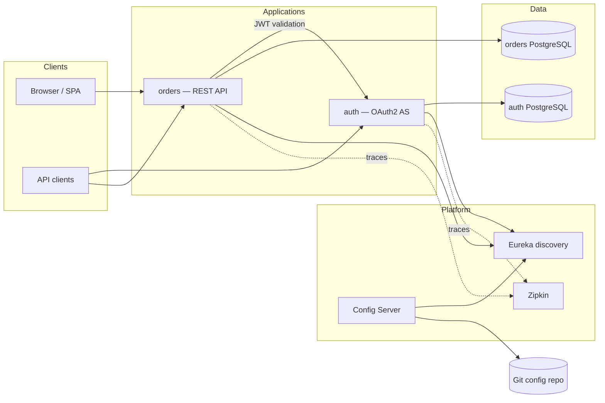

# Architecture

This repository is a multi-module Spring ecosystem for an **orders** domain backed by **OAuth2 authorization**, **service discovery**, and **centralized configuration**.

## System context

## Modules

| Module | Role |
|--------|------|
| **discovery** | Netflix Eureka server. Other services register and resolve instances. |
| **config** | Spring Cloud Config Server. Loads YAML per application from a Git repository (`search-paths: '{application}'`). HTTPS with a PKCS12 keystore in container setups. |
| **auth** | Spring Authorization Server (OAuth2). Issues tokens; persists clients and users in PostgreSQL. Registers with Eureka. |
| **orders** | Resource server: products, orders, inventory, optional email notifications. JWT validated against auth JWKS. Registers with Eureka. |

## Cross-cutting concerns

- **Distributed tracing**: Micrometer Tracing with Brave; spans exported to Zipkin. Logs include `[applicationName,traceId,spanId]` via MDC.
- **Circuit breaking**: Resilience4j (Spring Cloud Circuit Breaker). OpenFeign clients use circuit breakers when enabled; outbound email sending uses a dedicated `emailSend` breaker instance.
- **Security**: Orders exposes browser/static routes and `/api/**` as a stateless JWT resource server. Auth uses form login for authorization flows and HTTP Basic for `/api/**` admin routes as configured.

## Request flow (typical API call)

1. Client obtains a token from **auth** (OAuth2).
2. Client calls **orders** `/api/**` with `Authorization: Bearer …`.
3. Orders validates the JWT using **JWKS** from auth (`AUTH_SERVER_JWK_SET_URI` / `spring.security.oauth2.resourceserver.jwt.jwk-set-uri`).
4. Trace context propagates across HTTP where clients use Spring-managed builders (and Feign with Micrometer integration).

For more detail on ports and environment variables, see [configuration-reference.md](configuration-reference.md).
